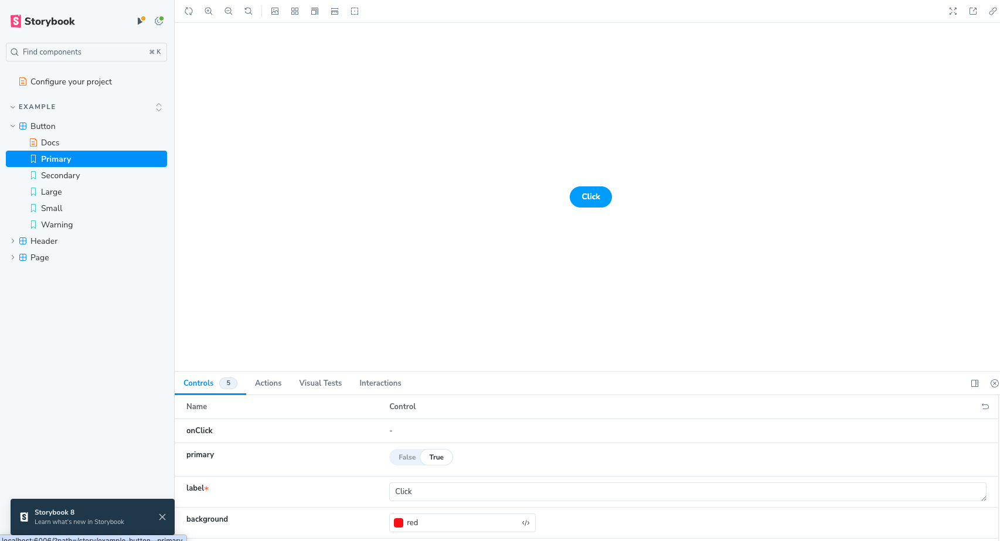

# Getting Started with Create React App

This project was bootstrapped with [Create React App](https://github.com/facebook/create-react-app).

Project is to learn Storybook

Storybook runs alongside your app in development mode. It helps you build UI components isolated from the business logic and context of your app.

Helpful resources: https://storybook.js.org/tutorials/intro-to-storybook/react/en/get-started/

## Getting Started - Scripts
* ``npm install``
* `npm start`

Runs the app in the development mode.\
Open [http://localhost:3000](http://localhost:3000) to view it in your browser.

## Storybook

* `npx create-react-app@5 learn-storybook –template typescript` 
* cd into folder `cd learn-storybook`
* open in VS Code
* Install storybook, `npx sb init`

Storybook opens

or run `npm run storybook`

## Learn More

You can learn more in the [Create React App documentation](https://facebook.github.io/create-react-app/docs/getting-started).

To learn React, check out the [React documentation](https://reactjs.org/).

YouTube Video by newline: https://www.youtube.com/watch?v=x-x47qHq3nY

